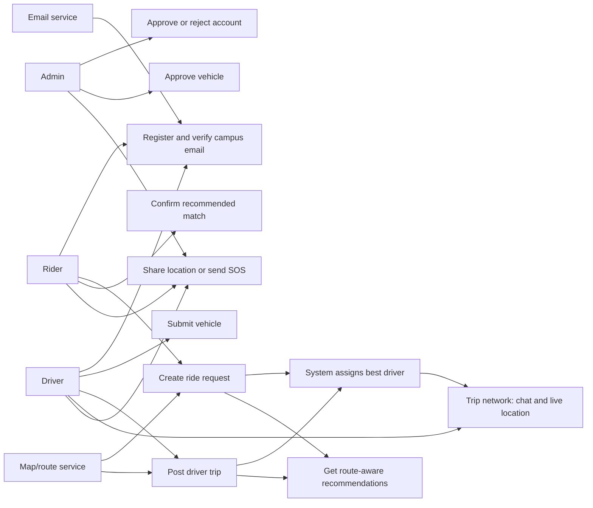
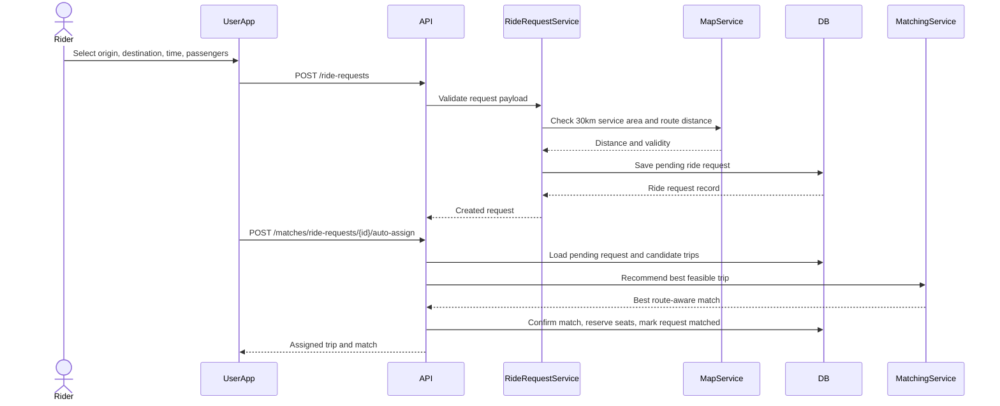
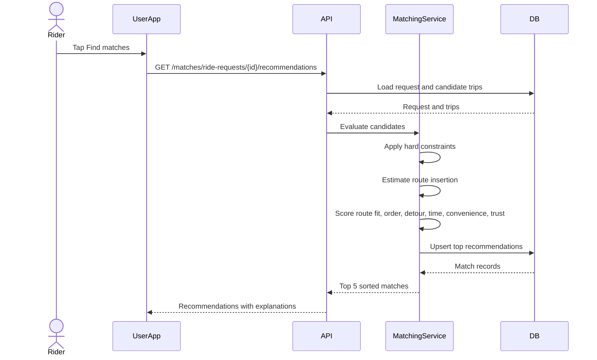
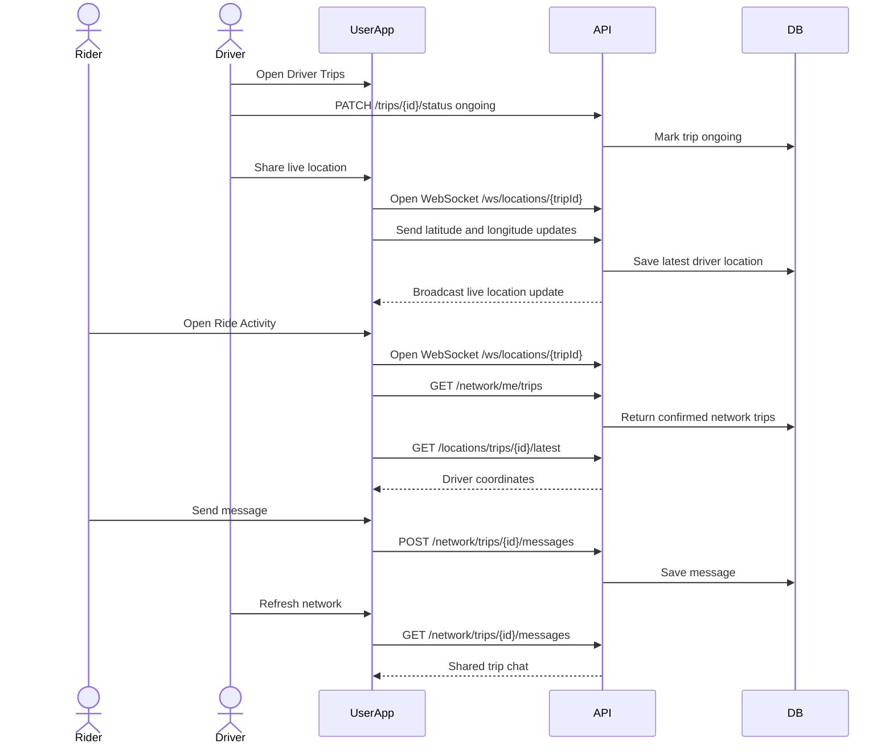
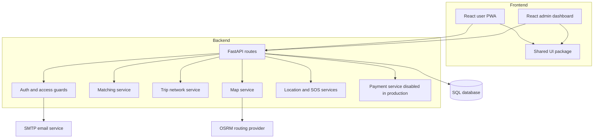

# MovU Diagram Guide

Use this guide to draw the business and software logic for the Taylor's University campus carpooling system.

For a connection-by-connection checklist, see `docs/DIAGRAM_RELATIONSHIPS.md`.

## 1. Use Case Diagram

Actors:
- Rider: registers, verifies email, requests ride, receives system-assigned driver, joins trip network, watches driver location, chats, sends SOS, rates/reports.
- Driver: enters through driver portal, registers, verifies email, submits vehicle, posts trip, accepts assigned riders, starts/completes trips, shares location, chats, receives ratings/reports.
- Admin: approves accounts, approves vehicles, monitors SOS, reviews reports, audits platform activity.
- Email service: sends verification emails.
- Map/route service: validates service area and route distance.
- Payment provider: future production payment collection, currently disabled.

Mermaid draft:

## 2. Main Business Flow

Draw this as an activity diagram:

1. User registers with Taylor's email.
2. System sends verification token.
3. User verifies email.
4. Admin approves account.
5. Rider creates a ride request with origin, destination, time, passengers, and gender preference.
6. Driver submits vehicle, waits for approval, then posts a trip.
7. System auto-assigns the best feasible driver when a rider creates a request.
8. Matching service filters candidates by hard constraints.
9. Matching service scores feasible candidates.
10. Confirmed riders and the driver enter a shared trip network.
11. Driver starts pickup and shares live location.
12. Rider watches driver location and chats with driver.
13. During active trip, users may trigger SOS.
14. Driver completes trip.
15. After trip, users can rate or report.

## 3. Ride Request Sequence

## 4. Matching Sequence

## 5. Trip Network Sequence

## 6. Matching Algorithm Logic

Hard constraints reject unsafe or impossible candidates first:
- Trip must be posted or already matchable.
- Ride request must still be pending.
- Driver must have enough available seats.
- Driver and passenger cannot be the same user.
- Preferred time must fall inside the configured time window.
- Same-gender preference must match driver/rider gender.
- All coordinates must stay inside Taylor's 30km service area.
- Route direction cannot be opposite.
- Driver detour and passenger walking distance must stay below limits.
- Passenger pickup must appear before dropoff along the driver's route.

Scoring then ranks feasible candidates:
- Route alignment: driver and passenger route bearings point in the same direction.
- Route order: projected pickup progress must be before projected dropoff progress.
- Driver detour: added distance and minutes are lower.
- Passenger convenience: pickup/dropoff walk, waiting time, shared ride duration, and route order.
- Time fit: departure time is close to preferred time.
- Driver acceptance: detour, route proximity, seats, passenger rating, and reliability.
- Supply efficiency: uses available seats efficiently without wasting scarce capacity.
- Trust/safety: combines passenger and driver rating/reliability.

## 7. Software Architecture Diagram

## 8. Suggested Diagrams For Submission

- Use case diagram: show Rider, Driver, Admin, Email service, Map service, Trip network.
- Activity diagram: registration to approval to ride/trip to auto-assign to network to safety/report.
- Sequence diagram 1: rider creates ride request and receives auto-assigned driver.
- Sequence diagram 2: matching recommendation.
- Sequence diagram 3: trip network chat and live driver location.
- Sequence diagram 4: SOS alert to admin.
- Class diagram: User, Vehicle, RideRequest, Trip, RideMatch, TripMessage, LocationLog, SOSEvent, RatingReport, Payment.
- Component diagram: React apps, shared UI package, FastAPI backend, database, SMTP, OSRM.
