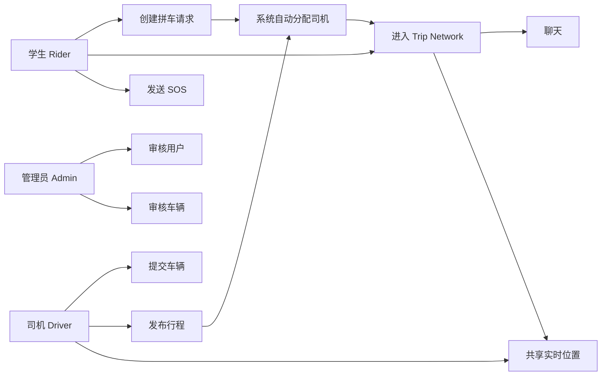
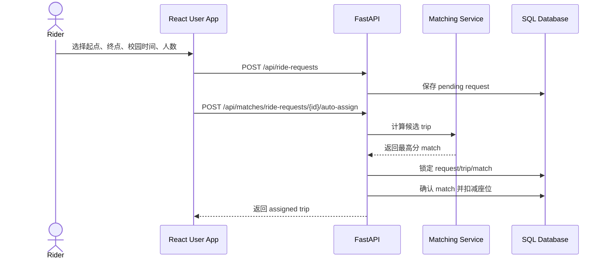
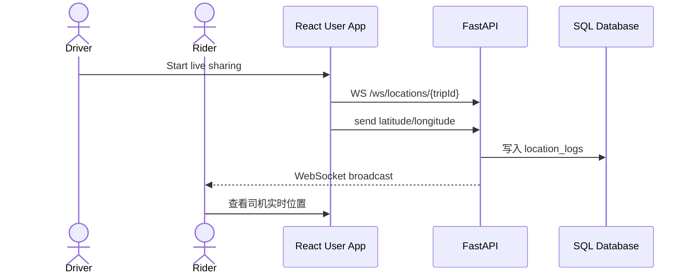

# MovU 中文设计与上线说明

这份文档回答上线前最容易被问到的几个问题：多个拼车用户如何联通、车辆信息如何显示、高并发如何处理、算法如何规划路线、手机时区不同怎么办、数据库之间如何关联和调用，以及 use case / sequence 图怎么画。

## 1. 运行思路

MovU 分为四层：

- 用户端 React PWA：学生发起请求、司机发布行程、Trip network 聊天、实时位置、SOS。
- 管理端 React：审核用户、审核车辆、查看 SOS、处理举报和审计。
- FastAPI 后端：认证、权限、匹配、车辆、行程、消息、位置、SOS、报告。
- SQL 数据库：保存用户、车辆、请求、行程、匹配、消息、位置、SOS、报告、审计。

本地运行：

```bash
PYTHONPATH=backend .venv/bin/python -m app.db.seed
PYTHONPATH=backend uvicorn app.main:app --reload --app-dir backend
cd user-app && npm run dev
```

生产运行：

```bash
docker compose -f docker-compose.prod.yml up --build
```

生产必须配置真实数据库、强 `JWT_SECRET_KEY`、SMTP、HTTPS 域名、CORS、OSRM 或等价路线服务，并执行：

```bash
alembic upgrade head
```

## 2. 多个拼车用户如何联通

学生创建 ride request 后，前端会调用：

```text
POST /api/ride-requests
POST /api/matches/ride-requests/{request_id}/auto-assign
```

后端会把学生请求和最合适的司机 trip 绑定成 confirmed match。所有 confirmed rider 和司机会进入同一个 Trip network：

```text
GET /api/network/me/trips
GET /api/network/trips/{trip_id}/messages
POST /api/network/trips/{trip_id}/messages
WS /ws/locations/{trip_id}
```

`/network/me/trips` 返回的不只是 trip，还包括：

- `driver`：司机姓名、角色、评分。
- `vehicle`：已审核车辆的车型、车牌、座位。
- `riders`：同车乘客姓名、人数、上车点、下车点。
- `available_seats` / `total_seats`：实时座位状态。

所以同一辆车里多个学生会看到同一个 Trip network、同一个司机车辆信息、同一个聊天区和实时位置。

## 3. 高并发怎么处理

当前代码做了三件基础保护：

1. 硬约束过滤：只有 pending request、posted/matched trip、座位足够、路线合适、时间窗合适才会推荐。
2. 数据库行锁：确认匹配时对 `matches`、`trips`、`ride_requests` 使用 `SELECT ... FOR UPDATE`，防止两个学生同时抢同一个座位。
3. 复查状态：真正扣座位前再次检查 request 状态、trip 状态、available seats。

核心流程：

```text
lock match row
lock trip row
lock ride_request row
check pending / available / seats
confirm match
request -> matched
trip.available_seats -= passenger_count
trip.status -> matched/full
commit
```

上线高并发建议：

- 生产数据库必须用 MySQL InnoDB 或 PostgreSQL 这类支持行级锁的数据库。
- 多实例部署时，rate limit 要换成 Redis-backed，不要只靠单进程内存。
- WebSocket 建议通过支持 sticky session 或集中 pub/sub 的网关。
- 自动分配可以升级为队列化 dispatch worker，避免高峰时所有请求直接打数据库。
- 对 `/matches/*/auto-assign` 做压力测试，重点观察锁等待、死锁重试、平均响应时间。

注意：任何拼车系统都不能保证“每一笔一定成功”。资源不足、司机满座、路线不匹配时，系统必须返回失败并让用户改时间/路线/人数。能保证的是：不会超卖座位，不会把同一座位错误分配给两个人。

## 4. 算法如何规划路线

MovU 当前不是简单最近距离匹配，而是 route-insertion 思路：

1. 司机有起点、终点、出发时间、座位数。
2. 学生有 pickup、dropoff、期望时间、人数、性别偏好。
3. 系统先过滤不可能的候选：
   - 时间窗超过配置。
   - 座位不足。
   - 性别偏好不满足。
   - 超出 Taylor's 30km 服务区。
   - 路线方向相反。
   - 司机绕行超过限制。
   - pickup/dropoff 不在合理路线附近。
4. 对可行候选评分：
   - route alignment：司机路线方向和乘客路线方向是否一致。
   - route order：pickup 是否在 dropoff 前面。
   - driver detour：插入乘客后司机多走多少。
   - passenger convenience：乘客步行、等待、绕行体验。
   - time fit：出发时间接近度。
   - supply efficiency：座位利用率。
   - trust safety：评分和可靠性。

最终返回 top 5，自动分配取最高分。

未来若要更接近 Grab / Uber / 滴滴：

- 用 OSRM route polyline 替代纯直线投影。
- 对每个 trip 维护 stop sequence：driver origin -> rider pickups -> rider dropoffs -> driver destination。
- 每新增一个 rider 时重算插入成本，选择总绕行最小且不违反约束的位置。
- 高峰期使用 dispatch batch，在 10-30 秒窗口内一起优化，而不是单请求贪心。

## 5. 手机时区不同怎么办

前端 `datetime-local` 不再按手机系统时区解释，而是按 Taylor's campus timezone：

```text
Asia/Kuala_Lumpur
```

提交时：

- 用户看到/输入的是校园当地时间。
- 前端转换成 UTC ISO timestamp。
- 同时提交 `preferred_time_timezone` 或 `departure_time_timezone`。
- 后端保存 UTC 时间和时区名。

这样即使用户手机在中国、英国、美国时区，预约的仍然是 Taylor's 校园时间。

## 6. 数据库之间的联系

核心表关系：

```text
users 1--N vehicles
users 1--N ride_requests
users 1--N trips
ride_requests 1--N matches
trips 1--N matches
trips 1--N trip_messages
trips 1--N location_logs
trips 1--N sos_events
users 1--N trip_messages
users 1--N location_logs
users 1--N rating_reports
```

业务调用关系：

- 登录后前端带 JWT 调 API。
- 学生创建 `ride_requests`。
- 司机创建 `trips`，车辆来自 `vehicles`。
- `matches` 连接某个 request 和某个 trip。
- confirmed match 决定谁能看到 Trip network。
- `trip_messages` 保存同一 trip 的聊天。
- `location_logs` 保存司机位置。
- `sos_events` 保存紧急事件。

## 7. Use Case 图怎么画

Actors：

- Rider
- Driver
- Admin
- Email Service
- Map/Route Service
- Database

Use cases：

- Register / Verify Email
- Approve Account
- Submit Vehicle
- Approve Vehicle
- Create Ride Request
- Post Trip
- Auto Assign Driver
- Join Trip Network
- Send Message
- Share Live Location
- Send SOS
- Rate / Report

Mermaid 示例：



## 8. Sequence 图怎么画

### 学生创建请求并自动分配



### Trip network 实时位置



## 9. 仍需上线前验证

- 真机定位权限和 HTTPS。
- 反向代理的 WebSocket `wss://` 配置。
- MySQL/PostgreSQL 行锁压力测试。
- OSRM/Nominatim 配额或自建服务。
- SMTP 真实发送。
- Admin 审核闭环。
- 备份、监控、日志、错误告警。
