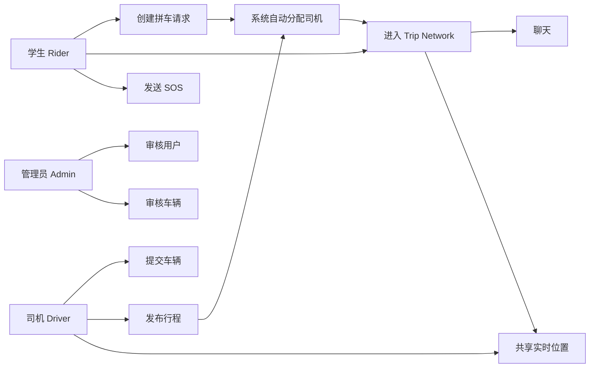
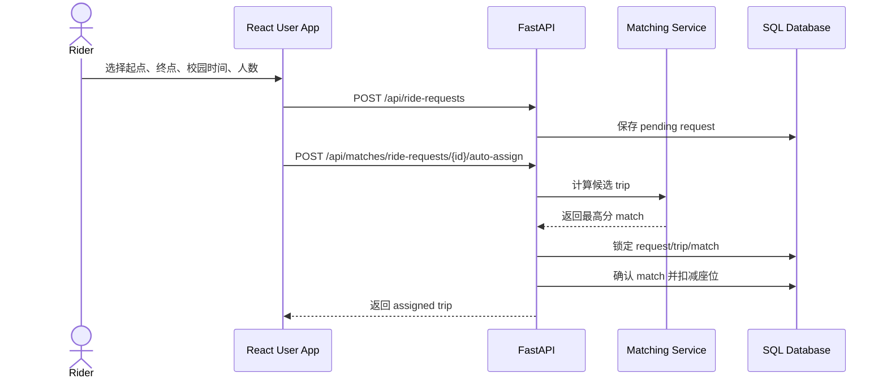
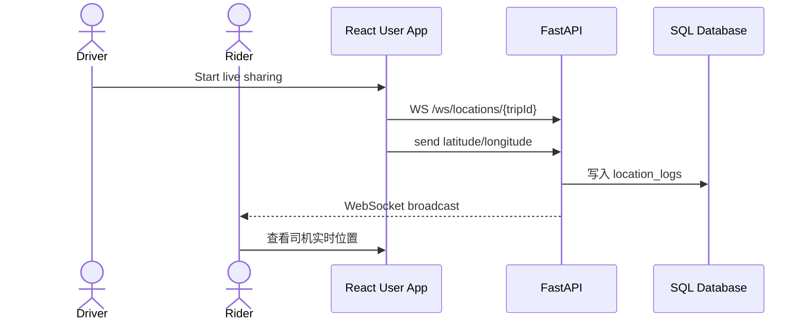
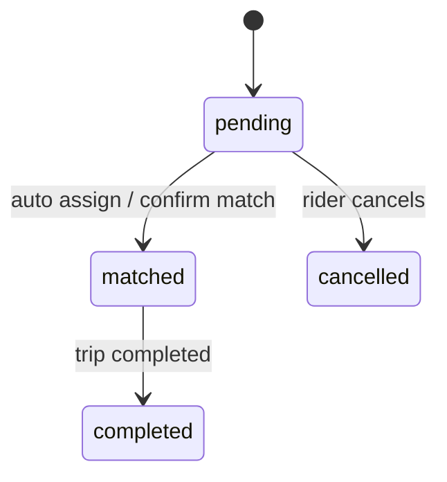
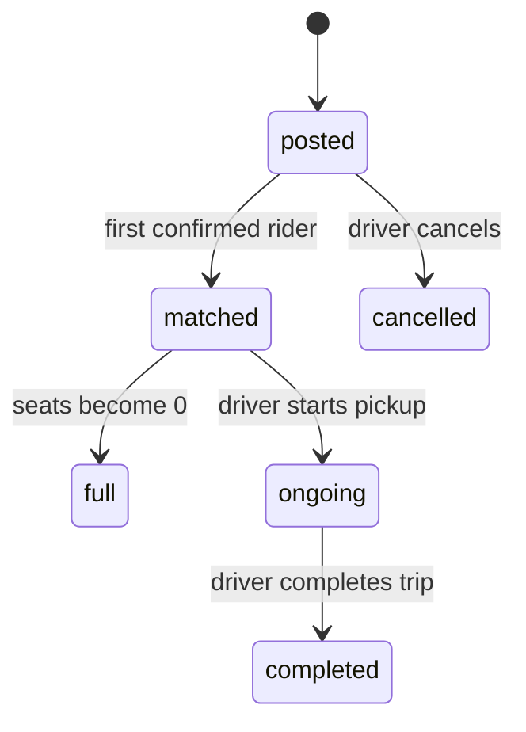
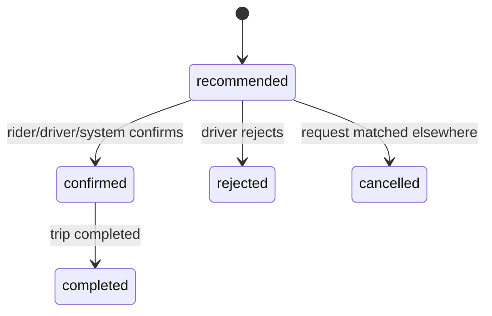
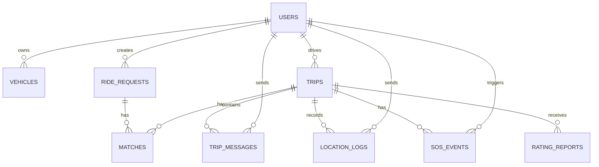
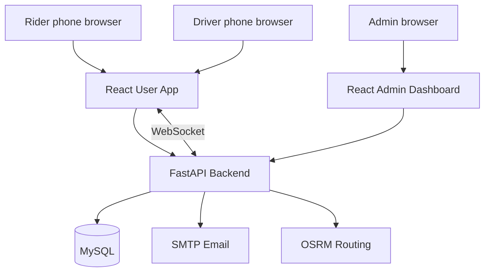

# MovU 中文设计与上线说明

这份文档回答上线前最容易被问到的几个问题：多个拼车用户如何联通、车辆信息如何显示、高并发如何处理、算法如何规划路线、手机时区不同怎么办、数据库之间如何关联和调用，以及 use case / sequence 图怎么画。

## 1. 运行思路

MovU 分为四层：

- 用户端 React PWA：学生发起请求、司机发布行程、Trip network 聊天、实时位置、SOS。
- 管理端 React：审核用户、审核车辆、查看 SOS、处理举报和审计。
- FastAPI 后端：认证、权限、匹配、车辆、行程、消息、位置、SOS、报告。
- SQL 数据库：保存用户、车辆、请求、行程、匹配、消息、位置、SOS、报告、审计。

本地运行：

```bash
PYTHONPATH=backend .venv/bin/python -m app.db.seed
PYTHONPATH=backend uvicorn app.main:app --reload --app-dir backend
cd user-app && npm run dev
```

生产运行：

```bash
docker compose -f docker-compose.prod.yml up --build
```

生产必须配置真实数据库、强 `JWT_SECRET_KEY`、SMTP、HTTPS 域名、CORS、OSRM 或等价路线服务，并执行：

```bash
alembic upgrade head
```

## 2. 多个拼车用户如何联通

学生创建 ride request 后，前端会调用：

```text
POST /api/ride-requests
POST /api/matches/ride-requests/{request_id}/auto-assign
```

后端会把学生请求和最合适的司机 trip 绑定成 confirmed match。所有 confirmed rider 和司机会进入同一个 Trip network：

```text
GET /api/network/me/trips
GET /api/network/trips/{trip_id}/messages
POST /api/network/trips/{trip_id}/messages
WS /ws/locations/{trip_id}
```

`/network/me/trips` 返回的不只是 trip，还包括：

- `driver`：司机姓名、角色、评分。
- `vehicle`：已审核车辆的车型、车牌、座位。
- `riders`：同车乘客姓名、人数、上车点、下车点。
- `available_seats` / `total_seats`：实时座位状态。

所以同一辆车里多个学生会看到同一个 Trip network、同一个司机车辆信息、同一个聊天区和实时位置。

## 3. 高并发怎么处理

当前代码做了三件基础保护：

1. 硬约束过滤：只有 pending request、posted/matched trip、座位足够、路线合适、时间窗合适才会推荐。
2. 数据库行锁：确认匹配时对 `matches`、`trips`、`ride_requests` 使用 `SELECT ... FOR UPDATE`，防止两个学生同时抢同一个座位。
3. 复查状态：真正扣座位前再次检查 request 状态、trip 状态、available seats。

核心流程：

```text
lock match row
lock trip row
lock ride_request row
check pending / available / seats
confirm match
request -> matched
trip.available_seats -= passenger_count
trip.status -> matched/full
commit
```

上线高并发建议：

- 生产数据库必须用 MySQL InnoDB 或 PostgreSQL 这类支持行级锁的数据库。
- 多实例部署时，rate limit 要换成 Redis-backed，不要只靠单进程内存。
- WebSocket 建议通过支持 sticky session 或集中 pub/sub 的网关。
- 自动分配可以升级为队列化 dispatch worker，避免高峰时所有请求直接打数据库。
- 对 `/matches/*/auto-assign` 做压力测试，重点观察锁等待、死锁重试、平均响应时间。

注意：任何拼车系统都不能保证“每一笔一定成功”。资源不足、司机满座、路线不匹配时，系统必须返回失败并让用户改时间/路线/人数。能保证的是：不会超卖座位，不会把同一座位错误分配给两个人。

## 4. 算法如何规划路线

MovU 当前不是简单最近距离匹配，而是 route-insertion 思路：

1. 司机有起点、终点、出发时间、座位数。
2. 学生有 pickup、dropoff、期望时间、人数、性别偏好。
3. 系统先过滤不可能的候选：
   - 时间窗超过配置。
   - 座位不足。
   - 性别偏好不满足。
   - 超出 Taylor's 30km 服务区。
   - 路线方向相反。
   - 司机绕行超过限制。
   - pickup/dropoff 不在合理路线附近。
4. 对可行候选评分：
   - route alignment：司机路线方向和乘客路线方向是否一致。
   - route order：pickup 是否在 dropoff 前面。
   - driver detour：插入乘客后司机多走多少。
   - passenger convenience：乘客步行、等待、绕行体验。
   - time fit：出发时间接近度。
   - supply efficiency：座位利用率。
   - trust safety：评分和可靠性。

最终返回 top 5，自动分配取最高分。

未来若要更接近 Grab / Uber / 滴滴：

- 用 OSRM route polyline 替代纯直线投影。
- 对每个 trip 维护 stop sequence：driver origin -> rider pickups -> rider dropoffs -> driver destination。
- 每新增一个 rider 时重算插入成本，选择总绕行最小且不违反约束的位置。
- 高峰期使用 dispatch batch，在 10-30 秒窗口内一起优化，而不是单请求贪心。

## 5. 手机时区不同怎么办

前端 `datetime-local` 不再按手机系统时区解释，而是按 Taylor's campus timezone：

```text
Asia/Kuala_Lumpur
```

提交时：

- 用户看到/输入的是校园当地时间。
- 前端转换成 UTC ISO timestamp。
- 同时提交 `preferred_time_timezone` 或 `departure_time_timezone`。
- 后端保存 UTC 时间和时区名。

这样即使用户手机在中国、英国、美国时区，预约的仍然是 Taylor's 校园时间。

## 6. 数据库之间的联系

核心表关系：

```text
users 1--N vehicles
users 1--N ride_requests
users 1--N trips
ride_requests 1--N matches
trips 1--N matches
trips 1--N trip_messages
trips 1--N location_logs
trips 1--N sos_events
users 1--N trip_messages
users 1--N location_logs
users 1--N rating_reports
```

业务调用关系：

- 登录后前端带 JWT 调 API。
- 学生创建 `ride_requests`。
- 司机创建 `trips`，车辆来自 `vehicles`。
- `matches` 连接某个 request 和某个 trip。
- confirmed match 决定谁能看到 Trip network。
- `trip_messages` 保存同一 trip 的聊天。
- `location_logs` 保存司机位置。
- `sos_events` 保存紧急事件。

## 7. Use Case 图怎么画

Actors：

- Rider
- Driver
- Admin
- Email Service
- Map/Route Service
- Database

Use cases：

- Register / Verify Email
- Approve Account
- Submit Vehicle
- Approve Vehicle
- Create Ride Request
- Post Trip
- Auto Assign Driver
- Join Trip Network
- Send Message
- Share Live Location
- Send SOS
- Rate / Report

Mermaid 示例：



## 8. Sequence 图怎么画

### 学生创建请求并自动分配



### Trip network 实时位置



## 9. 仍需上线前验证

- 真机定位权限和 HTTPS。
- 反向代理的 WebSocket `wss://` 配置。
- MySQL/PostgreSQL 行锁压力测试。
- OSRM/Nominatim 配额或自建服务。
- SMTP 真实发送。
- Admin 审核闭环。
- 备份、监控、日志、错误告警。

## 10. 硬性技术选型对应关系

项目必须满足的硬性要求如下：

| 要求 | 当前实现 | 关键位置 | 说明 |
| --- | --- | --- | --- |
| 前端 React | React + TypeScript + Vite | `user-app`, `admin-dashboard` | 用户端和管理端都使用 React。 |
| 后端 FastAPI | FastAPI + SQLAlchemy | `backend/app/main.py` | 所有 REST API 和 WebSocket route 都挂载在 FastAPI app 上。 |
| 网络 WebSocket | 司机位置、管理员 SOS | `backend/app/api/location.py`, `backend/app/api/sos.py` | `WS /ws/locations/{trip_id}` 和 `WS /ws/admin/sos`。 |
| 数据库 MySQL | Docker Compose 使用 MySQL 8.4 | `docker-compose.yml`, `docker-compose.prod.yml` | `DATABASE_URL=mysql+pymysql://...`。SQLite 只用于测试隔离。 |
| Docker 封装 | backend、user-app、admin-dashboard、mysql | `backend/Dockerfile`, `user-app/Dockerfile`, `admin-dashboard/Dockerfile` | Compose 一次启动完整系统。 |

生产部署时的服务关系：

```text
Browser
  -> user-app container, admin-dashboard container
  -> backend FastAPI container
  -> MySQL container
  -> SMTP provider
  -> OSRM / route provider
```

## 11. Docker 和 MySQL 运行细节

`docker-compose.yml` 负责本地 Docker 流程：

- `mysql`：MySQL 8.4，保存业务数据。
- `backend`：FastAPI，启动前运行 migration。
- `admin-dashboard`：管理端 React build。
- `user-app`：用户端 React build。

生产版 `docker-compose.prod.yml` 需要通过环境变量提供敏感信息：

```text
MOVU_DB_PASSWORD
JWT_SECRET_KEY
SMTP_HOST
SMTP_FROM_EMAIL
SMTP_USERNAME
SMTP_PASSWORD
CORS_ORIGINS
PUBLIC_API_BASE_URL
```

推荐生产启动顺序：

1. 启动 MySQL。
2. backend 等待 MySQL healthcheck。
3. backend 执行 `alembic upgrade head`。
4. backend 启动 FastAPI。
5. 前端容器提供静态文件。
6. 反向代理把 `/api` 和 `/ws` 转给 backend。

反向代理必须支持 WebSocket upgrade：

```text
Connection: Upgrade
Upgrade: websocket
```

否则学生端看不到司机实时位置，管理员端也收不到 SOS 实时提醒。

## 12. 核心 API 调用表

| 场景 | 前端动作 | API | 写入/读取表 |
| --- | --- | --- | --- |
| 注册 | 输入邮箱、密码、角色 | `POST /api/auth/register` | `users` |
| 邮箱验证 | 点击验证链接 | `POST /api/auth/verify-email` | `users.email_verified` |
| 管理员审核用户 | Admin 修改状态 | `PATCH /api/users/{id}/verification` | `users.verification_status` |
| 司机提交车辆 | Driver Garage 表单 | `POST /api/vehicles` | `vehicles` |
| 管理员审核车辆 | Admin 审核 | `PATCH /api/vehicles/{id}/verification` | `vehicles.verification_status` |
| 学生发请求 | Rider Book | `POST /api/ride-requests` | `ride_requests` |
| 系统自动分配 | 创建请求后自动调用 | `POST /api/matches/ride-requests/{id}/auto-assign` | `matches`, `trips`, `ride_requests` |
| 司机发布行程 | Driver Trip | `POST /api/trips` | `trips` |
| 查看拼车网络 | Activity / Driver Trips | `GET /api/network/me/trips` | `trips`, `matches`, `users`, `vehicles`, `ride_requests` |
| 行程聊天 | Trip network 输入框 | `POST /api/network/trips/{id}/messages` | `trip_messages` |
| 司机实时位置 | Share once / live sharing | `POST /api/locations` 或 `WS /ws/locations/{id}` | `location_logs` |
| SOS | Safety 页确认呼叫 | `POST /api/sos` | `sos_events` |
| 评分/举报 | 行程后提交 | `POST /api/reports/ratings`, `POST /api/reports` | `rating_reports` |

## 13. 数据库表设计细节

### `users`

保存所有登录用户。

关键字段：

- `user_id`：主键。
- `role`：`rider` / `driver` / `admin`。
- `email_verified`：邮箱是否验证。
- `verification_status`：管理员审核状态。
- `rating`：评分。
- `is_banned`：是否封禁。

关系：

- 一个 user 可以有多个 vehicle。
- 一个 rider 可以有多个 ride_request。
- 一个 driver 可以有多个 trip。
- user 可以发送 trip_message、location_log、sos_event、rating_report。

### `vehicles`

保存司机车辆。

关键字段：

- `driver_id`：关联 `users.user_id`。
- `plate_number`：车牌，唯一。
- `vehicle_model`：车型。
- `seat_count`：座位数。
- `verification_status`：车辆审核状态。

只有 approved vehicle 的司机才允许发布 trip。Trip network 只展示 approved vehicle。

### `ride_requests`

保存学生拼车请求。

关键字段：

- `rider_id`：谁发起。
- `origin` / `destination`：文本地点。
- `origin_latitude` / `origin_longitude`：起点坐标。
- `destination_latitude` / `destination_longitude`：终点坐标。
- `preferred_time`：UTC 时间。
- `preferred_time_timezone`：用户输入时使用的 IANA 时区，目前为 `Asia/Kuala_Lumpur`。
- `passenger_count`：乘客人数。
- `gender_preference`：性别偏好。
- `distance_km`：路线距离。
- `status`：`pending` / `matched` / `cancelled` / `completed`。

### `trips`

保存司机发布的行程。

关键字段：

- `driver_id`：司机。
- `origin` / `destination`：司机路线。
- `departure_time`：UTC 时间。
- `departure_time_timezone`：司机输入时使用的 IANA 时区。
- `available_seats`：当前剩余座位。
- `total_seats`：初始座位。
- `status`：`posted` / `matched` / `ongoing` / `completed` / `cancelled` / `full`。

### `matches`

连接一个 `ride_request` 和一个 `trip`。

关键字段：

- `trip_id`：关联司机行程。
- `request_id`：关联学生请求。
- `rider_id`：冗余保存 rider，便于查询。
- `match_score`：总分。
- `score_breakdown`：各评分项。
- `reasons`：解释原因。
- `status`：`recommended` / `confirmed` / `rejected` / `cancelled` / `completed`。

### `trip_messages`

Trip network 聊天消息。

关键字段：

- `trip_id`：哪一辆车/哪次行程。
- `sender_id`：谁发的消息。
- `body`：消息内容，最多 600 字符。
- `created_at`：发送时间。

### `location_logs`

司机位置轨迹。

关键字段：

- `trip_id`：行程。
- `user_id`：必须是该 trip 的 driver。
- `latitude` / `longitude`：坐标。
- `timestamp`：记录时间。

只允许 ongoing trip 的司机写入位置。

### `sos_events`

紧急呼叫。

关键字段：

- `user_id`：触发 SOS 的用户。
- `trip_id`：当前/最近行程。
- `latitude` / `longitude`：触发位置。
- `status`：`new` / `reviewing` / `resolved` / `false_alarm`。

## 14. 订单状态机

### Ride request 状态



### Trip 状态



### Match 状态



## 15. 高并发事务设计

最容易出错的是座位扣减。例如一辆车只剩 1 个座位，两个学生同时点击创建请求，如果没有锁，就可能同时看到 `available_seats = 1`，最后两个人都成功。

当前确认 match 的事务顺序：

```text
BEGIN
SELECT match FOR UPDATE
SELECT trip FOR UPDATE
SELECT ride_request FOR UPDATE
check match.status in recommended/confirmed
check ride_request.status == pending
check trip.status in posted/matched
check trip.available_seats >= ride_request.passenger_count
match.status = confirmed
ride_request.status = matched
trip.available_seats -= passenger_count
if trip.available_seats == 0: trip.status = full
cancel other recommended matches for same request
COMMIT
```

这解决的是一致性问题：

- 不会超卖座位。
- 不会一个 request 同时匹配多个 trip。
- 不会 confirmed match 被随便 reject。

仍要做的生产增强：

- MySQL 设置合理事务隔离级别，建议至少 `READ COMMITTED` 或按实际测试决定。
- 捕获 deadlock，自动重试 1-3 次。
- 高峰期将 auto-assign 放入队列，按区域/时间批处理。
- 增加 Prometheus 指标：锁等待时间、匹配耗时、失败原因、WebSocket 在线数。

## 16. 路线匹配算法伪代码

当前核心逻辑可以用下面伪代码理解：

```text
function recommendTrips(request):
  candidates = trips where status in (posted, matched)
  results = []

  for trip in candidates:
    if request.status != pending: reject
    if trip.available_seats < request.passenger_count: reject
    if abs(trip.departure_time - request.preferred_time) > time_window: reject
    if gender_preference not satisfied: reject
    if outside Taylor service area: reject

    route = evaluateRouteInsertion(trip, request)
    if route.direction_is_opposite: reject
    if route.pickup_after_dropoff: reject
    if route.driver_detour_km > max_driver_detour_km: reject
    if route.pickup_offset_km > max_pickup_offset_km: reject
    if route.dropoff_offset_km > max_dropoff_offset_km: reject

    score =
      route_alignment * 0.25 +
      driver_detour * 0.20 +
      passenger_convenience * 0.20 +
      time_fit * 0.15 +
      driver_acceptance * 0.10 +
      supply_efficiency * 0.05 +
      trust_safety * 0.05

    if score >= min_match_score:
      results.add(match, score, reasons)

  return top 5 by score
```

评分含义：

- `route_alignment`：路线方向越一致越高。
- `driver_detour`：司机绕行越少越高。
- `passenger_convenience`：乘客上车/下车越方便越高。
- `time_fit`：出发时间越接近越高。
- `driver_acceptance`：司机越可能接受越高。
- `supply_efficiency`：座位利用越合理越高。
- `trust_safety`：评分和可靠性越好越高。

当前实现适合校园内 30km 范围的小规模拼车。若要扩大到城市级实时拼车，需要引入：

- 路线 polyline。
- 多 stop sequence 优化。
- 批量 dispatch。
- ETA 预测。
- 司机当前位置和未来路线动态重算。

## 17. WebSocket 实时位置设计

实时位置有两条路径：

### 单次共享

司机点击 `Share once`：

```text
navigator.geolocation.getCurrentPosition
POST /api/locations
backend validates driver owns ongoing trip
insert location_logs
broadcast to WebSocket subscribers
```

### 持续共享

司机点击 `Start live sharing`：

```text
navigator.geolocation.watchPosition
open WS /ws/locations/{trip_id}?token=JWT
send { latitude, longitude }
backend validates token + trip access
insert location_logs
broadcast update to riders and driver
```

学生端打开 Activity 后：

```text
GET /api/network/me/trips
GET /api/locations/trips/{trip_id}/latest
open WS /ws/locations/{trip_id}?token=JWT
receive live driver coordinates
```

权限规则：

- 司机只能写自己 ongoing trip 的位置。
- confirmed rider 可以读对应 trip 的位置。
- admin 可以查看位置日志。
- 未匹配用户不能订阅别人的 trip location。

## 18. 手机时区详细策略

问题来源：

`datetime-local` 本身不带时区。如果用户手机在英国，输入 `2026-07-07 09:00`，浏览器默认会理解成英国 9 点，而不是马来西亚 9 点。

MovU 的处理方式：

1. 业务时间统一按 Taylor's 校园时间输入：`Asia/Kuala_Lumpur`。
2. 前端显示 datetime-local 时，用 campus timezone 格式化。
3. 用户提交时，前端把 campus local time 转成 UTC ISO。
4. 后端保存 UTC 时间，并保存 timezone 字段。
5. 列表展示时，再按 campus timezone 显示。

数据例子：

```json
{
  "preferred_time": "2026-07-07T01:00:00.000Z",
  "preferred_time_timezone": "Asia/Kuala_Lumpur"
}
```

含义是：Taylor's 当地时间 `2026-07-07 09:00`。

## 19. 页面和代码结构

用户端主要结构：

```text
user-app/src/routes/App.tsx
  控制路由和角色 guard

user-app/src/routes/AppLayout.tsx
  顶部语言/登出，底部导航

user-app/src/pages/AuthPage.tsx
  Student / Driver portal

user-app/src/pages/HomePage.tsx
  学生/司机首页入口

user-app/src/pages/RidePage.tsx
  学生创建请求、查看 activity、自动分配、network panel

user-app/src/pages/DrivePage.tsx
  司机车辆、发布行程、开始/完成行程、network panel

user-app/src/pages/SafetyPage.tsx
  一键 SOS、自动获取当前/最近 trip

user-app/src/components/TripNetworkPanel.tsx
  同车乘客、车辆、聊天、实时位置

user-app/src/components/CampusMapPicker.tsx
  地图选点和固定路线
```

后端主要结构：

```text
backend/app/api
  auth.py, users.py, vehicles.py, ride_requests.py, trips.py,
  matches.py, network.py, location.py, sos.py, reports.py

backend/app/models
  User, Vehicle, RideRequest, Trip, RideMatch,
  TripMessage, LocationLog, SOSEvent, RatingReport

backend/app/services
  matching.py: 路线和匹配算法
  maps.py: 服务区和路线距离
  location.py: 位置权限和写入
  realtime.py: WebSocket manager
```

低耦合原则：

- 页面不直接操作数据库。
- React 页面只通过 `api/client.ts` 调后端。
- 匹配算法放在 `services/matching.py`，不塞进 API route。
- WebSocket 管理放在 `services/realtime.py`。
- Trip network 聚合放在 `api/network.py`，不让前端自己拼多张表。

## 20. 画图提交建议

如果课程/报告需要画图，建议至少画 6 张：

1. Use case diagram：参与者和功能范围。
2. Activity diagram：从注册到完成行程。
3. Sequence diagram：学生创建请求并自动分配。
4. Sequence diagram：Trip network 聊天和实时位置。
5. ERD / class diagram：数据库实体关系。
6. Component diagram：React、FastAPI、MySQL、WebSocket、SMTP、OSRM。

ERD 可以按这个结构画：



Component diagram 可以这样画：



## 21. 上线验收 Checklist

### 功能验收

- 学生注册、邮箱验证、管理员审核。
- 司机注册、车辆提交、管理员审核。
- 学生创建 ride request。
- 系统自动分配司机。
- 司机 Trips 页面看到 assigned rider。
- 学生 Activity 页面看到司机、车辆、同车乘客。
- 行程聊天双方可见。
- 司机 Start live sharing 后学生端收到坐标。
- SOS 自动带 trip 和坐标。
- 行程完成后可评分/举报。

### 技术验收

- Docker Compose 可从空数据库启动。
- `alembic upgrade head` 成功。
- MySQL 数据持久化 volume 正常。
- HTTPS 可访问前端。
- `wss://` WebSocket 正常。
- CORS 只允许生产域名。
- SMTP 可真实发送。
- OSRM 或路线服务稳定。
- 后端日志包含错误堆栈。
- 有数据库备份策略。

### 压测验收

- 100 个学生同时请求同一路线，不超卖座位。
- 1000 个 WebSocket 连接不断线。
- 高峰 auto-assign 平均响应时间可接受。
- 数据库无长时间锁等待。
- 后端 CPU/RAM 在可控范围。

建议压测重点不是“每一笔都成功”，而是：

- 座位不超卖。
- 失败原因明确。
- 系统不崩。
- 数据库一致。
- 用户可重试。
